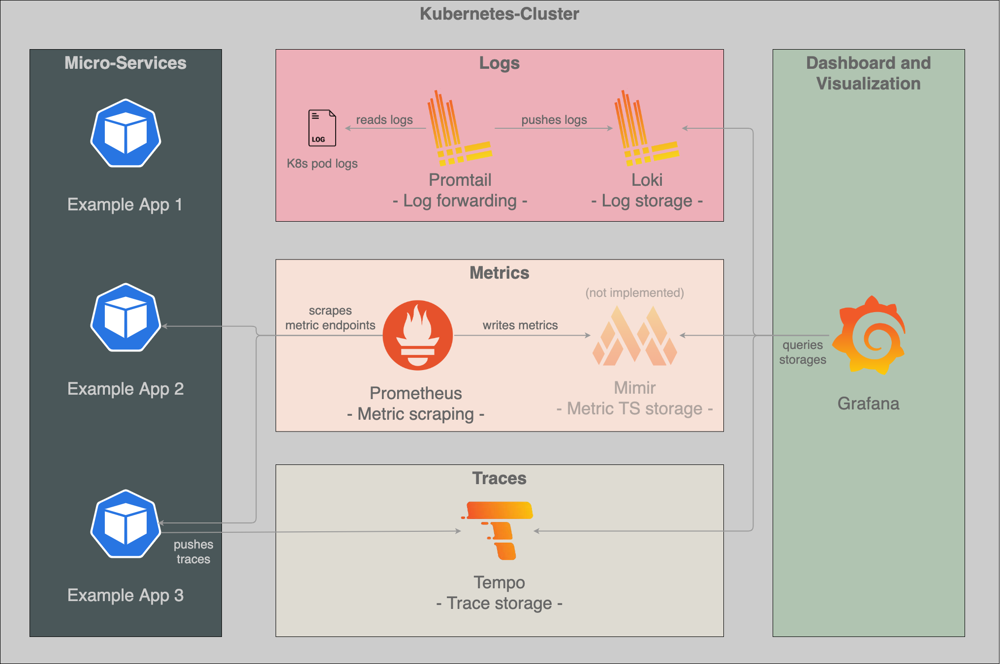

<h1 align="center">
	
</h1>

<h3 align="center">
	This is an example how observability can be achieved in a technical sense with ML-Models using an Open Source Observability Stack with:<br>
    <a href="https://grafana.com/" target="_blank">Grafana</a> | <a href="https://prometheus.io/" target="_blank">Prometheus</a> | <a href="https://min.io/" target="_blank">Promtail</a> | <a href="https://grafana.com/docs/loki/latest/clients/promtail/" target="_blank">Loki</a> | <a href="https://grafana.com/oss/tempo/" target="_blank">Tempo</a> | <a href="https://min.io/" target="_blank">MinIO</a> | <a href="https://opentelemetry.io/" target="_blank">OpenTelemetry</a><br>
    @<a href="https://kubernetes.io/" target="_blank">K8s</a>
</h3>

<p align="center">
    
    
    
</p>

<p align="center">
  <a href="#addressed-issues">Addressed Issues</a> •
  <a href="#technical-observability-in-machine-learning">Technical Observability in ML</a> •
  <a href="#target-groups">Target Groups</a> •
  <a href="#architecture">Architecture</a> •
  <a href="#setup">Setup</a> •
  <a href="#upcoming-considerations">Upcoming Considerations</a>
</p>

# Addressed Issues
Not implementing monitoring in software development is a serious issue because it can lead to increased downtime, poor user experience, inefficient resource utilization, security vulnerabilities, and difficulty in identifying the root cause of errors. These issues can impact the success of the software development project and the satisfaction of its users.

Therefore, this project explains the three pillars of observability in software monitoring and how they can be implemented in the context of a Machine Learning Model. Those pillars are **logs**, **metrics**, and **traces**. These three elements work together to provide a comprehensive view of an application's behavior and performance in an environment consisting of microservices.


## What is Observability?
Observability refers to the ability to gain insight into the internal workings of a software system through monitoring, logging, and analyzing its behavior. It involves collecting data about the system's performance, events, and errors, and making that data available for analysis and troubleshooting.

## Logs:
Logging involves capturing and storing specific application events and error messages in a structured format for later analysis. Logs can provide valuable insights into an application's behavior, helping to identify errors, performance issues, and security threats. Logging is typically used to capture information about application events such as HTTP requests, database queries, and system errors.

## Metrics:
Metrics are quantitative measures of an application's performance. They are typically collected at regular intervals and stored in a time-series database for later analysis and can provide a real-time view of an application's performance, allowing teams to identify performance issues and track improvements over time.

Golden Signals (see [Google's Golden Signals](https://sre.google/sre-book/monitoring-distributed-systems/#xref_monitoring_golden-signals)):
- **Latency:** "The time it takes to service a request"
- **Traffic:** "A measure of how much demand is being placed on your system"
- **Errors:** "The rate of requests that fail, either explicitly (e.g., HTTP 500s), implicitly (for example, an HTTP 200 success response, but coupled with the wrong content), or by policy"
- **Saturation:** "How "full" your service is. A measure of your system fraction, emphasizing the resources that are most constrained."

## Traces
Tracing involves tracking the flow of requests through an application, including all of the services and components involved in processing the request. Tracing provides a detailed view of an application's behavior, helping to identify performance bottlenecks and pinpoint the source of errors. Tracing can be used to identify issues such as slow database queries, network latency, and inefficient code.


# Technical Observability in Machine Learning
As machine learning applications are very similar to traditional applications in a technical sense, they need to be monitored as well. However, there are some aspects to take a closer look at, that may differ slightly from traditional software applications.

**Metrics:** Regarding Google's Golden Signals the latency is important to measure the time our service takes for some input including data preprocessing and generating predictions. Another example is the saturation. ML-Models tend to acquire a lot of resources. Is our hardware strong enough to serve the amount of requests?

**Logs:** The logs are the first source of information when an application needs debugging. E.g. this can be important to retrace errors in the data preprocessing graph.

**Traces:** When metrics indicate long latencies, traces help to identify which step in the data prepocessing graph takes how long for a given input or how fast our model can generate predictions.

# Target Groups
The three pillars of observability - logging, metrics, and tracing - are important for various roles involved in software development and operations, including:

**1. Developers:** Developers can use logs to debug issues in their code, metrics to optimize performance, and traces to identify bottlenecks and optimize request flow.

**2. Operations teams:** Observability data helps operations teams monitor the health of the application, diagnose and resolve issues quickly, and optimize performance to meet service level objectives (SLOs) and service level agreements (SLAs).

**3. DevOps teams:** Observability data can help DevOps teams identify issues and coordinate with developers and operations teams to resolve them quickly and efficiently.

**4. Business stakeholders:** Observability data can provide valuable insights into user behavior, performance trends, and the impact of changes to the application, helping stakeholders make data-driven decisions and prioritize areas for improvement.

# Architecture


**Visualization:** We use Grafana to provide a user-friendly interface for visualizing and analyzing data from various sources.

**Logs:** We use Loki to provide a horizontally-scalable, highly-available, and multi-tenant log aggregation system for cloud-native applications and infrastructure. Therefore, Promtail helps to collect those logs from the log files of the K8s pods and sends them to Loki for storage, analysis, and visualization.

**Metrics:** We use Prometheus to collect, store, and analyze metrics as time-series data for monitoring K8s applications and infrastructure. Note: Grafana Mimir is not part of this architecture because Prometheus can store the metrics in an own timeseries database to some extent. This is good enough for this example. In a real world scenario you would definitely choose a separate metric store.

**Traces:** We use Tempo to provide a scalable and cost-effective distributed tracing backend for cloud-native applications and infrastructure.

# Setup
Helm charts are in our setup advantageous because they provide an easy and repeatable way to package, configure, and deploy complex applications on Kubernetes clusters. They also provide versioning, rollback, and templating capabilities, making it easy to manage application deployments across multiple environments.

## Creating a K8s-Namespace
```
kubectl create ns technical-observability-for-ml
```
## Installing Tool-Chain via Helm

### Grafana
Installation
```
# see https://artifacthub.io/packages/helm/grafana/grafana/6.50.8
helm repo add grafana https://grafana.github.io/helm-charts
helm repo update
helm upgrade -f helm-config/grafana/values.yaml --install -n technical-observability-for-ml grafana grafana/grafana --version 6.50.8
```

Get your 'admin' user password by running:
```
kubectl get secret --namespace technical-observability-for-ml grafana -o jsonpath="{.data.admin-password}" | base64 --decode ; echo
```

### MinIO
Installation
```
# see https://artifacthub.io/packages/helm/bitnami/minio/12.1.8
helm repo add bitnami https://charts.bitnami.com/bitnami
helm repo update
helm upgrade -f helm-config/minio/values.yaml --install -n technical-observability-for-ml minio bitnami/minio --version 12.1.8
```

Get credentials:
```
kubectl get secret --namespace technical-observability-for-ml minio -o jsonpath="{.data.root-user}" | base64 -d
kubectl get secret --namespace technical-observability-for-ml minio -o jsonpath="{.data.root-password}" | base64 -d
```

Login into MinIO by navigating to "http://localhost:30001" and create a new bucket called "loki"

### Loki
```
# see https://artifacthub.io/packages/helm/grafana/loki/4.6.1
helm repo add grafana https://grafana.github.io/helm-charts
helm repo update
helm upgrade -f helm-config/loki/values.yaml --install -n technical-observability-for-ml loki grafana/loki
```

### Promtail
```
# see https://artifacthub.io/packages/helm/grafana/promtail/6.9.0
helm repo add grafana https://grafana.github.io/helm-charts
helm repo update
helm upgrade -f helm-config/promtail/values.yaml --install -n technical-observability-for-ml promtail grafana/promtail --version 6.9.0
```

### Tempo
```
# see https://artifacthub.io/packages/helm/grafana/tempo/1.0.0
helm repo add grafana https://grafana.github.io/helm-charts
helm repo update
helm upgrade -f helm-config/tempo/values.yaml --install -n technical-observability-for-ml tempo grafana/tempo --version 1.0.0
```

### Prometheus
```
# see https://artifacthub.io/packages/helm/prometheus-community/prometheus/19.6.1
helm repo add prometheus-community https://prometheus-community.github.io/helm-charts
helm repo update
helm upgrade -f helm-config/prometheus/values.yaml --install -n technical-observability-for-ml prometheus prometheus-community/prometheus --version 19.6.1
```

# Upcoming Considerations
...